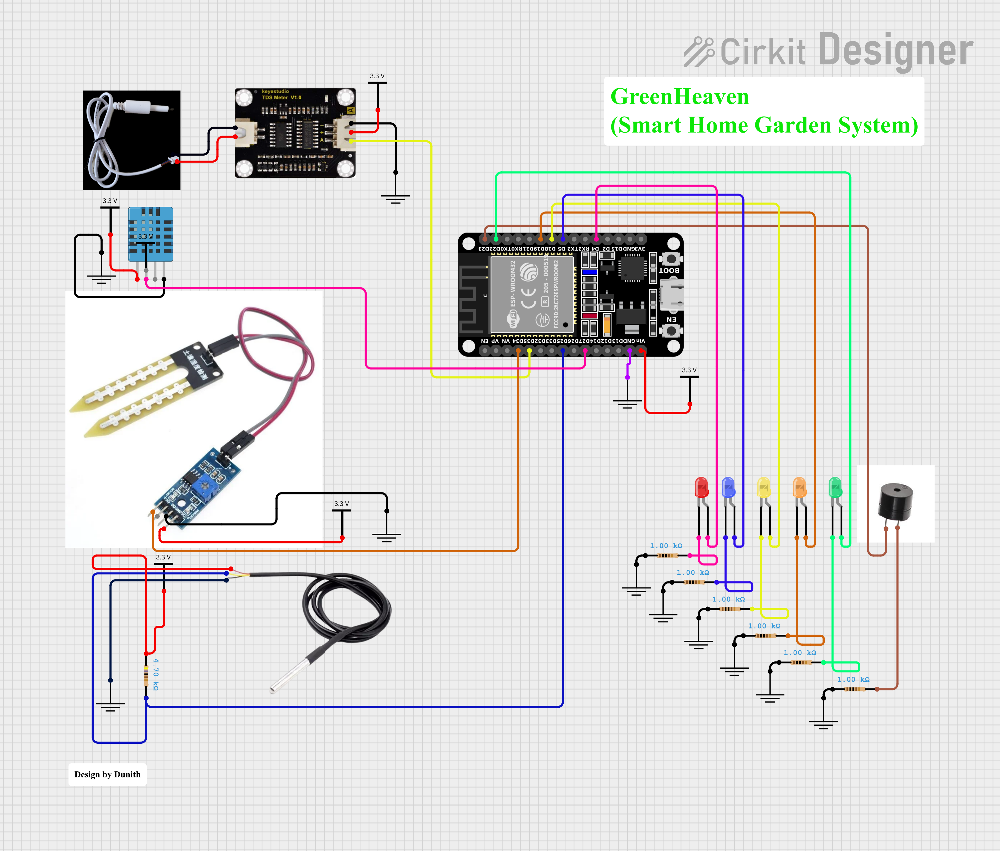
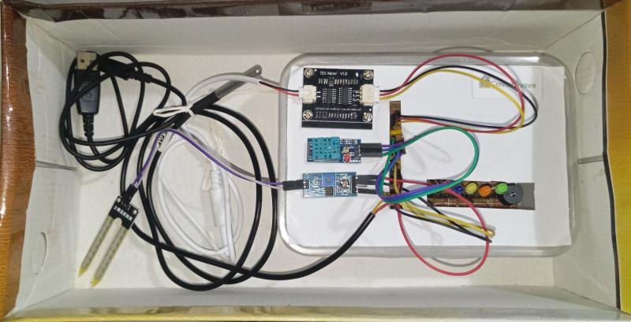
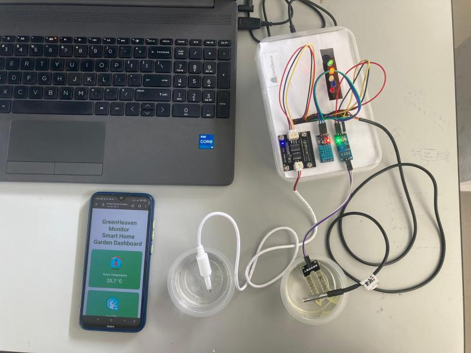
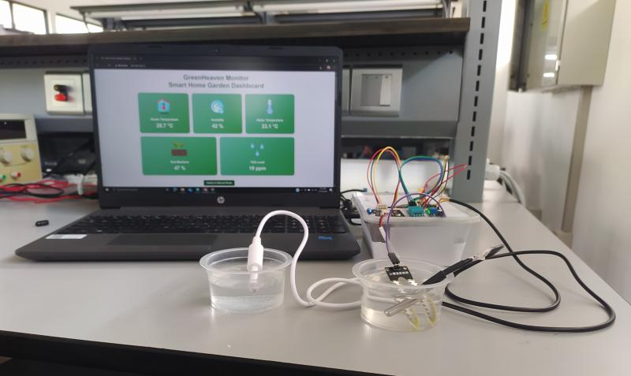
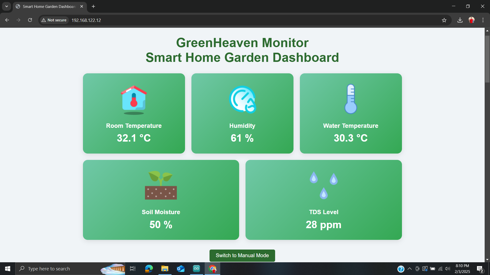
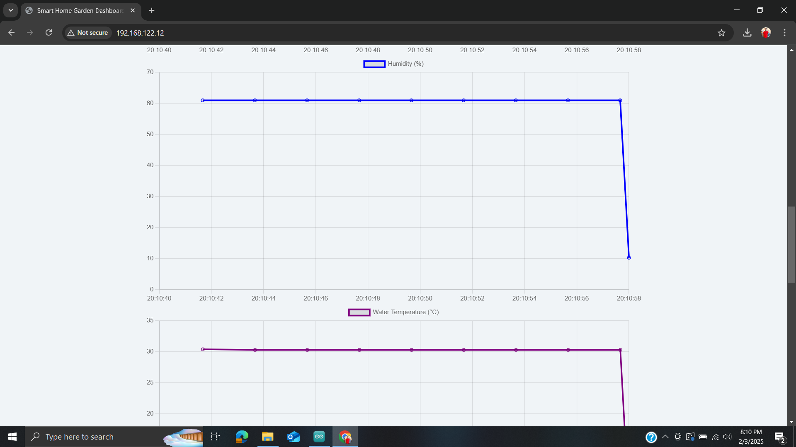
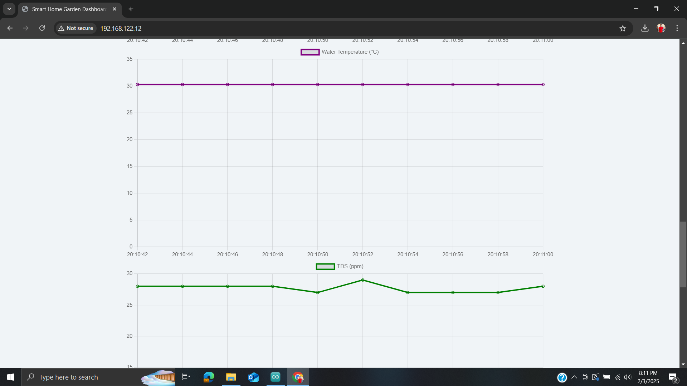
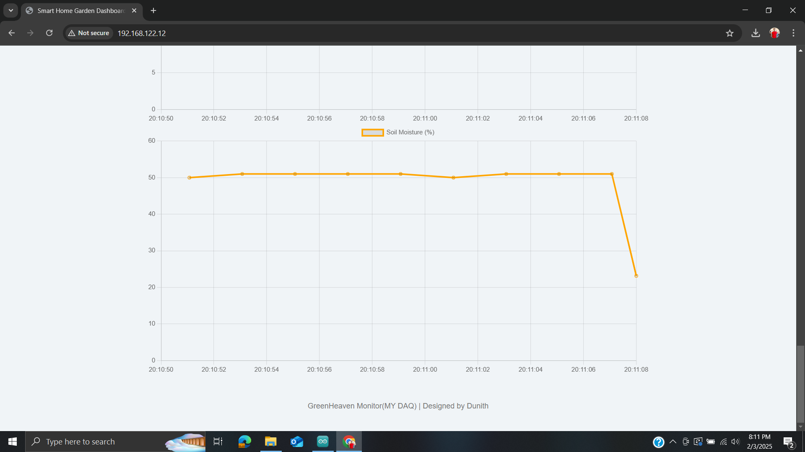

# 🌿 GreenHeavenDAQ: Smart Home Garden Monitoring System

### ✨ Project Summary
GreenHeavenDAQ is a sophisticated, automated environmental monitoring system designed for home gardens. Its primary function is Automated Data Acquisition (DAQ), providing continuous, real-time intelligence on critical environmental and water parameters. Built around the ESP32 microcontroller, the system provides real-time alerting and features an intuitive web-based dashboard for advanced visualization and analysis.

* **GreenHeaven Logo**


|  | Role | Key Feature |
| :--- | :--- | :--- |
| **Microcontroller** | ESP32 | High-performance, low-power processing and Wi-Fi capability for IoT integration. |
| **Sensors** | DHT11, DS18B20, Soil Moisture, TDS | Accurate, multi-point data acquisition for environmental and water quality metrics. |
| **Front-End** | HTML, CSS, JavaScript | Critical input for automated irrigation decision-making. |
| **Alert System** | Arduino (C++) / LEDs/Buzzer | Provides real-time alerts to notify the user of critical conditions. |

### 🎯 Key Functionalities and System Architecture
The project's architecture focuses on reliable data collection and user-friendly interaction.

### 1. Data Acquisition (DAQ)
The system continuously monitors five essential environmental and water parameters:
| Sensor | Parameter Measured | Purpose |
| :--- | :--- | :--- |
| **DHT11** | Room Temperature & Humidity | Monitoring ambient plant conditions and identifying potential stress. |
| **DS18B20** | Water Temperature | Optimizing water delivery conditions, particularly for hydroponic applications. |
| **Capacitive Sensor** | Soil Moisture | Critical input for automated irrigation decision-making. |
| **TDS Sensor** | Water Quality (Total Dissolved Solids) | Tracking nutrient concentration in water, essential for plant feeding. |

* **GreenHeaven Circuit**



* **Physical Prototype Setup**





### 2. Automated Alerting System
The core control function is the non-physical alerting mechanism:

* **Real-Time Anomaly Detection:** The system automatically compares sensor values against predefined safety thresholds.

* **LED & Buzzer Alerts:** Provides immediate, local audio-visual feedback when parameters deviate (e.g., soil too dry, water quality drops), prompting user attention.


### 3. User Interface & Analysis
A local web server hosted on the ESP32 provides a powerful user experience:

* **Real-Time Data Dashboard:** Displays all five sensor values concurrently.

* **Graphical Plotting:** Uses JavaScript to generate dynamic graphs, allowing users to track parameter changes over time and analyze trends.

* **Configurability:** Allows setting custom thresholds for irrigation and alerts.

* **Web Dashboard UI**

```






```


### 🗃️ LabVIEW Data Interface (GreenHeavenDAQ Feature)
To extend the system's data processing and visualization capabilities, a separate interface was developed using LabVIEW.

* **Purpose:** Allows for high-fidelity, advanced data logging, signal processing, and external visualization outside of the standard web server environment.

* **Integration:** The LabVIEW code connects directly to the system's data stream for detailed analysis.

* **Files:** The main project files for this interface are located in the `labview_interface_modified/` directory.

* **LabVIEW Interface**


### 📈 Expected Outcomes and Benefits

| Outcome | Benefit |
| :--- | :--- |
| **Data Automation** | Continuous, automated data logging eliminates the need for manual checks. |
| **Risk Prevention** | Automated alerts notify the user immediately of potential problems (e.g., temperature spikes). | 
| **Informed Decisions** | Users can make precise, data-driven watering and nutrient adjustments based on real-time information. |

### 👥 Acknowledging

I would like to express my sincere gratitude to the **Department of Instrumentation & Automation**, **Faculty of Technology, University of Colombo**, for providing me with the opportunity, guidance, and resources necessary to successfully complete this project.
